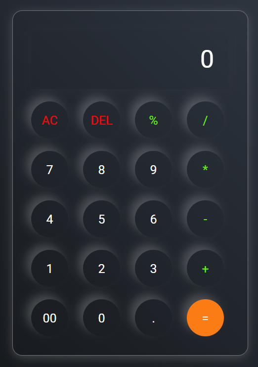

# 🧮 Basic Calculator Application

A simple and responsive calculator web application built using **HTML, CSS, and JavaScript**.
This calculator performs basic arithmetic operations with a clean and modern user interface.

---

# 🔗 Live Demo

👉 https://riya6567.github.io/Basic-calculator-application/

---

# 📂 GitHub Repository

👉 https://github.com/Riya6567/Basic-calculator-application

---

# ✨ Features

* Addition, Subtraction, Multiplication, Division
* Percentage Calculation
* Responsive Design
* Modern UI
* Keyboard-Friendly Operations
* Real-time Display Update
* Error Handling

---

# 🛠️ Technologies Used

## Frontend

* HTML5
* CSS3
* JavaScript

---

# 📸 Project Preview




---

# 🚀 How to Run Locally

## Clone the Repository

```bash id="8sl3k1"
git clone https://github.com/Riya6567/Basic-calculator-application.git
```

## Open Project Folder

```bash id="7dk29a"
cd Basic-calculator-application
```

## Run the Project

Simply open the `index.html` file in your browser.

---

# 📂 Project Structure

```bash id="v4m90p"
Basic-calculator-application/
│
├── index.html
├── style.css
└── script.js
```

---

# 🎯 Functionalities

* Clear Screen
* Delete Last Character
* Decimal Number Support
* Percentage Calculation
* Responsive Button Layout

---

# 📱 Responsive Design

The calculator is fully responsive and works smoothly on:

* Desktop
* Tablet
* Mobile Devices

---

# 🔮 Future Improvements

* Scientific Calculator Features
* Dark/Light Theme Toggle
* History Section
* Keyboard Shortcuts
* Advanced Mathematical Functions

---

# 👩‍💻 Author

## Riya

BCA 4th year Student | Aspiring Frontend Developer, Python Developer & ML Enthusiasist

* GitHub: https://github.com/Riya6567
* LinkedIn: https://linkedin.com/in/riya-dey-9a3556358

---

# ⭐ Support
If you like this project, please give it a ⭐ on GitHub!
